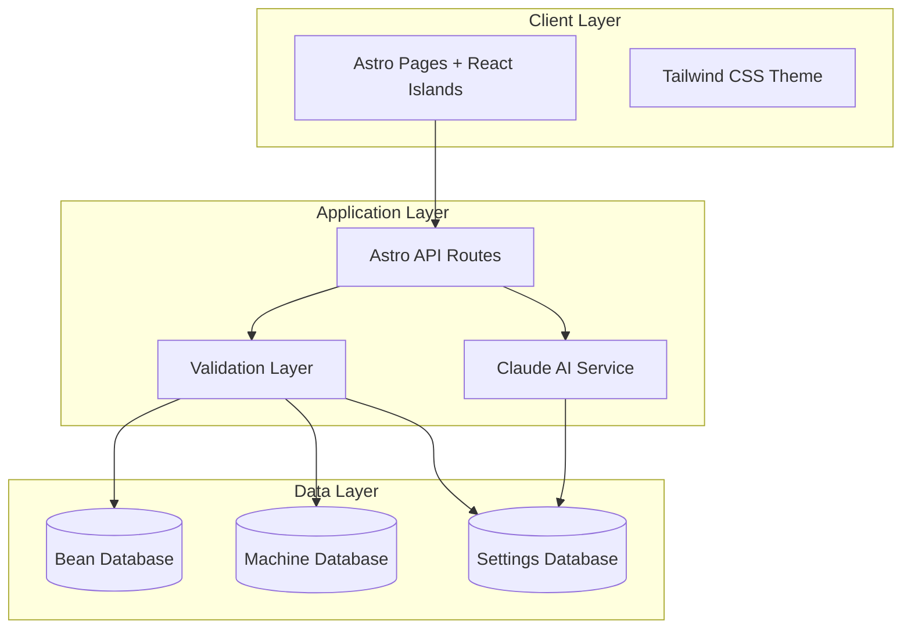

# Design Document: Coffee Recommendation Engine

## Overview

The Coffee Recommendation Engine is a modern web application built with Astro.js that leverages AI to provide personalized coffee brewing recommendations. The system uses Astro's islands architecture to deliver optimal performance while maintaining rich interactivity through React components. The application integrates with Claude API to analyze coffee bean and brewing equipment combinations, generating precise brewing parameters including temperature, grind size, brew time, and water ratios.

The architecture prioritizes performance through static site generation, type safety through comprehensive TypeScript implementation, and user experience through a minimalist design system built with Tailwind CSS.

## Architecture

### High-Level Architecture



### Islands Architecture Implementation

The application leverages Astro's islands architecture where:
- **Static Components**: Navigation, content pages, and layout components render as static HTML
- **Interactive Islands**: Bean/machine selectors, recommendation forms, and results display use React with client-side hydration
- **Hydration Strategy**: Components hydrate on interaction (`client:load` for critical UI, `client:idle` for secondary features)

### Technology Stack

- **Frontend Framework**: Astro.js 4.x with React integration
- **Type System**: TypeScript with strict configuration
- **Styling**: Tailwind CSS with custom design tokens
- **AI Integration**: Claude API via Anthropic SDK
- **Data Storage**: JSON-based local storage with TypeScript schemas
- **Build System**: Astro's built-in Vite-based build system

## Components and Interfaces

### Core Components

#### 1. Bean Selector Component (React Island)
```typescript
interface BeanSelectorProps {
  onBeanSelect: (bean: CoffeeBean) => void;
  selectedBean?: CoffeeBean;
}

interface CoffeeBean {
  id: string;
  brand: string;
  origin: string;
  roastLevel: 'light' | 'medium' | 'dark';
  flavorProfile: string[];
  processingMethod: string;
}
```

#### 2. Machine Selector Component (React Island)
```typescript
interface MachineSelectorProps {
  onMachineSelect: (machine: BrewingMachine) => void;
  selectedMachine?: BrewingMachine;
}

interface BrewingMachine {
  id: string;
  type: 'espresso' | 'pour-over' | 'french-press' | 'aeropress' | 'drip';
  brand: string;
  model: string;
  temperatureRange: [number, number]; // [min, max] in Fahrenheit
  optimalGrindSizes: GrindSize[];
}
```

#### 3. Recommendation Display Component (React Island)
```typescript
interface RecommendationDisplayProps {
  recommendation: BrewingRecommendation;
  bean: CoffeeBean;
  machine: BrewingMachine;
}

interface BrewingRecommendation {
  temperature: {
    fahrenheit: number;
    celsius: number;
  };
  grindSize: GrindSize;
  brewTime: {
    minutes: number;
    seconds: number;
  };
  waterRatio: {
    coffee: number;
    water: number;
    description: string; // e.g., "1:16 ratio"
  };
  explanation: string;
  confidence: number; // 0-1 scale
}
```

### API Layer Interfaces

#### 1. Recommendation API Route
```typescript
// /api/recommendations.ts
interface RecommendationRequest {
  beanId: string;
  machineId: string;
}

interface RecommendationResponse {
  success: boolean;
  data?: BrewingRecommendation;
  error?: string;
  fallbackUsed?: boolean;
}
```

#### 2. Data API Routes
```typescript
// /api/beans.ts
interface BeansResponse {
  beans: CoffeeBean[];
}

// /api/machines.ts
interface MachinesResponse {
  machines: BrewingMachine[];
}
```

### Service Layer

#### Claude AI Service
```typescript
interface ClaudeService {
  generateRecommendation(
    bean: CoffeeBean, 
    machine: BrewingMachine
  ): Promise<BrewingRecommendation>;
  
  isAvailable(): Promise<boolean>;
}

interface ClaudePromptTemplate {
  systemPrompt: string;
  userPrompt: (bean: CoffeeBean, machine: BrewingMachine) => string;
  responseSchema: object;
}
```

## Data Models

### Database Schema

#### Coffee Beans Collection
```typescript
interface CoffeeBean {
  id: string;
  brand: string;
  origin: string;
  region?: string;
  altitude?: number;
  roastLevel: 'light' | 'medium' | 'medium-dark' | 'dark';
  roastDate?: string;
  flavorProfile: string[];
  processingMethod: 'washed' | 'natural' | 'honey' | 'semi-washed';
  varietals?: string[];
  notes?: string;
  createdAt: string;
  updatedAt: string;
}
```

#### Brewing Machines Collection
```typescript
interface BrewingMachine {
  id: string;
  type: BrewingMethodType;
  brand: string;
  model: string;
  temperatureRange: {
    min: number;
    max: number;
    unit: 'fahrenheit' | 'celsius';
  };
  optimalGrindSizes: GrindSize[];
  brewTimeRange: {
    min: number;
    max: number;
    unit: 'seconds';
  };
  waterRatioRange: {
    min: number;
    max: number;
  };
  features?: string[];
  createdAt: string;
  updatedAt: string;
}

type BrewingMethodType = 
  | 'espresso' 
  | 'pour-over' 
  | 'french-press' 
  | 'aeropress' 
  | 'drip' 
  | 'cold-brew' 
  | 'moka-pot';

interface GrindSize {
  level: number; // 1-10 scale (1 = extra-fine, 10 = extra-coarse)
  description: GrindSizeDescription;
  microns?: number; // Optional particle size in microns
}

type GrindSizeDescription = 
  | 'extra-fine' 
  | 'fine' 
  | 'medium-fine' 
  | 'medium' 
  | 'medium-coarse' 
  | 'coarse' 
  | 'extra-coarse';
```

#### Settings Cache Collection
```typescript
interface CachedRecommendation {
  id: string;
  beanId: string;
  machineId: string;
  recommendation: BrewingRecommendation;
  source: 'ai' | 'fallback';
  confidence: number;
  createdAt: string;
  expiresAt: string;
}
```

### Validation Schemas

Using Zod for runtime type validation:

```typescript
import { z } from 'zod';

const CoffeeBeanSchema = z.object({
  id: z.string().uuid(),
  brand: z.string().min(1).max(100),
  origin: z.string().min(1).max(100),
  roastLevel: z.enum(['light', 'medium', 'medium-dark', 'dark']),
  flavorProfile: z.array(z.string()).min(1),
  processingMethod: z.enum(['washed', 'natural', 'honey', 'semi-washed'])
});

const BrewingMachineSchema = z.object({
  id: z.string().uuid(),
  type: z.enum(['espresso', 'pour-over', 'french-press', 'aeropress', 'drip']),
  brand: z.string().min(1).max(100),
  model: z.string().min(1).max(100),
  temperatureRange: z.object({
    min: z.number().min(150).max(220),
    max: z.number().min(150).max(220)
  })
});
```

## Correctness Properties

*A property is a characteristic or behavior that should hold true across all valid executions of a system—essentially, a formal statement about what the system should do. Properties serve as the bridge between human-readable specifications and machine-verifiable correctness guarantees.*

### Property 1: Database Query Completeness
*For any* valid bean or machine selection, the database query should return complete data including all required characteristics, specifications, and metadata fields
**Validates: Requirements 1.2, 1.3**

### Property 2: UI State Management
*For any* combination of user selections (complete or incomplete), the UI should correctly enable or disable recommendation functionality and provide appropriate guidance
**Validates: Requirements 1.4, 1.5**

### Property 3: AI Service Integration
*For any* valid bean-machine combination, when the AI service is available, it should be called with correct parameters and return a properly formatted recommendation
**Validates: Requirements 2.1**

### Property 4: AI Response Format Completeness
*For any* AI-generated recommendation, the response should contain temperature in both Fahrenheit and Celsius, grind size with both numeric level and description, properly formatted brew time, and valid water-to-coffee ratios
**Validates: Requirements 2.2, 2.3, 2.4, 2.5**

### Property 5: Fallback Behavior
*For any* bean-machine combination, when the AI service is unavailable, the system should return fallback recommendations from the settings database without failing
**Validates: Requirements 2.6, 8.3**

### Property 6: Data Storage Integrity
*For any* valid coffee bean, brewing machine, or recommendation data, the storage system should preserve all required fields and maintain data integrity according to defined schemas
**Validates: Requirements 3.1, 3.2, 3.3**

### Property 7: Input Validation
*For any* data input (valid or invalid), the system should validate against defined schemas and either accept valid data or reject invalid data with appropriate error messages
**Validates: Requirements 3.4, 8.2**

### Property 8: Responsive Design
*For any* viewport size within the supported range, UI components should render correctly and maintain usability across mobile and desktop devices
**Validates: Requirements 4.2**

### Property 9: SEO and Meta Tag Completeness
*For any* page in the application, the rendered HTML should contain proper meta tags for SEO including title, description, and other required metadata
**Validates: Requirements 6.1, 6.5**

### Property 10: Semantic HTML Structure
*For any* page in the application, the HTML should use semantic elements and maintain proper heading hierarchy for accessibility
**Validates: Requirements 6.2**

### Property 11: Image Accessibility
*For any* image or visual element in the application, it should have appropriate alt text or accessibility attributes
**Validates: Requirements 6.3**

### Property 12: Keyboard Navigation
*For any* interactive element in the application, it should be accessible via keyboard navigation and maintain proper focus management
**Validates: Requirements 6.4**

### Property 13: Navigation Consistency
*For any* page in the application, navigation elements and branding should be consistent and provide access to all required features
**Validates: Requirements 7.5**

### Property 14: Error Handling
*For any* API request failure or system error, the application should display user-friendly error messages and handle failures gracefully
**Validates: Requirements 8.1**

### Property 15: Network Retry Logic
*For any* network error during API requests, the system should implement exponential backoff retry logic before failing
**Validates: Requirements 8.4**

### Property 16: Privacy-Preserving Logging
*For any* error or system event, logging should capture necessary debugging information while excluding sensitive user data
**Validates: Requirements 8.5**

## Error Handling

### Error Categories and Responses

#### 1. AI Service Errors
- **Claude API Unavailable**: Return cached recommendations with fallback indicator
- **Claude API Rate Limiting**: Implement exponential backoff with user notification
- **Invalid AI Response**: Validate response schema and use fallback if invalid

#### 2. Data Validation Errors
- **Invalid Bean Selection**: Display specific field validation errors
- **Invalid Machine Selection**: Highlight missing or incorrect specifications
- **Schema Validation Failures**: Provide detailed field-level error messages

#### 3. Network and Performance Errors
- **Request Timeouts**: Retry with exponential backoff (max 3 attempts)
- **Network Connectivity**: Display offline indicator and cached data when available
- **Database Query Failures**: Log errors and provide fallback responses

#### 4. User Interface Errors
- **Component Hydration Failures**: Graceful degradation to static content
- **Form Submission Errors**: Preserve user input and display specific error guidance
- **Navigation Errors**: Redirect to homepage with error notification

### Error Recovery Strategies

```typescript
interface ErrorRecoveryStrategy {
  retryPolicy: {
    maxAttempts: number;
    backoffMultiplier: number;
    initialDelay: number;
  };
  fallbackBehavior: 'cache' | 'default' | 'redirect';
  userNotification: {
    message: string;
    severity: 'info' | 'warning' | 'error';
    dismissible: boolean;
  };
}
```

## Testing Strategy

### Dual Testing Approach

The Coffee Recommendation Engine employs both unit testing and property-based testing to ensure comprehensive coverage:

**Unit Tests** focus on:
- Specific examples of bean-machine combinations
- Edge cases in data validation
- Error conditions and fallback scenarios
- Integration points between components
- UI component rendering with specific props

**Property Tests** focus on:
- Universal properties that hold across all valid inputs
- Comprehensive input coverage through randomization
- Validation of system behavior across the entire input space
- Correctness properties defined in the design document

### Property-Based Testing Configuration

**Testing Library**: Fast-check for TypeScript/JavaScript property-based testing
**Test Configuration**:
- Minimum 100 iterations per property test
- Each property test references its corresponding design document property
- Tag format: **Feature: coffee-recommendation-engine, Property {number}: {property_text}**

**Example Property Test Structure**:
```typescript
import fc from 'fast-check';

describe('Coffee Recommendation Engine Properties', () => {
  test('Property 4: AI Response Format Completeness', () => {
    // Feature: coffee-recommendation-engine, Property 4: AI Response Format Completeness
    fc.assert(fc.property(
      fc.record({
        bean: validCoffeeBeanArbitrary,
        machine: validBrewingMachineArbitrary
      }),
      async ({ bean, machine }) => {
        const recommendation = await aiService.generateRecommendation(bean, machine);
        
        expect(recommendation.temperature).toHaveProperty('fahrenheit');
        expect(recommendation.temperature).toHaveProperty('celsius');
        expect(validGrindSizes).toContain(recommendation.grindSize);
        expect(recommendation.brewTime).toHaveProperty('minutes');
        expect(recommendation.brewTime).toHaveProperty('seconds');
        expect(recommendation.waterRatio).toHaveProperty('coffee');
        expect(recommendation.waterRatio).toHaveProperty('water');
      }
    ), { numRuns: 100 });
  });
});
```

### Testing Coverage Requirements

**Unit Test Coverage**:
- Component rendering and interaction
- API route functionality
- Data validation edge cases
- Error handling scenarios
- Accessibility compliance

**Property Test Coverage**:
- All 16 correctness properties from the design document
- Data integrity across all operations
- UI behavior consistency
- Error recovery mechanisms
- Performance characteristics where applicable

### Integration Testing

**End-to-End Scenarios**:
- Complete user journey from selection to recommendation
- AI service integration with fallback testing
- Cross-browser compatibility
- Mobile responsiveness validation
- SEO and accessibility compliance

**Performance Testing**:
- Page load time validation
- API response time monitoring
- Database query performance
- Static asset optimization verification